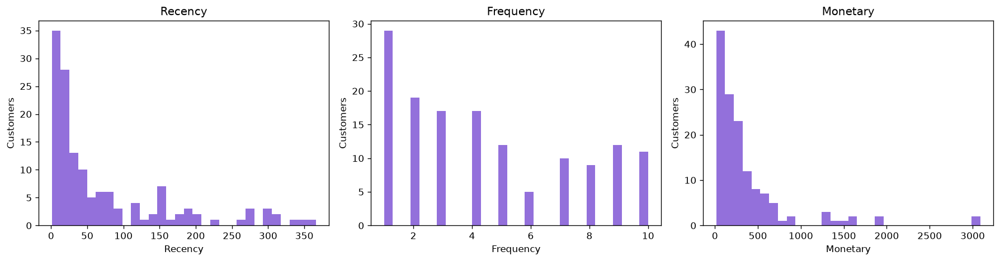
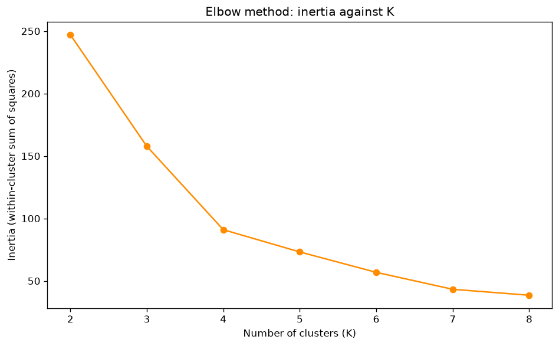
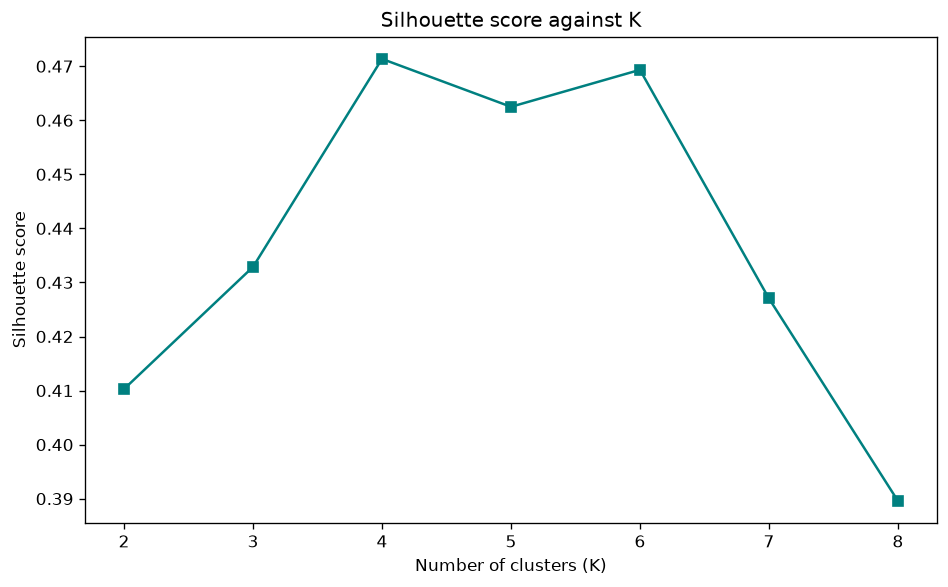
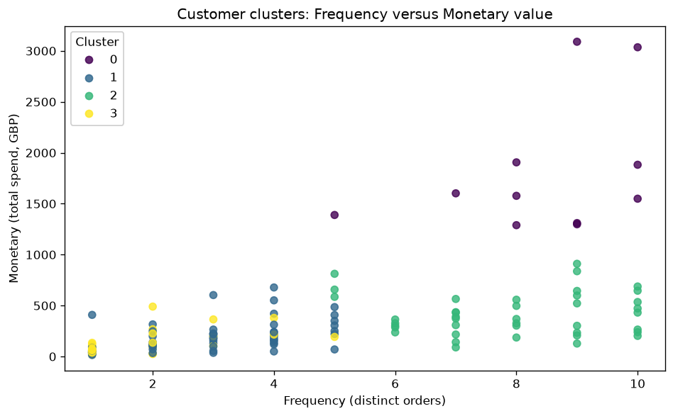
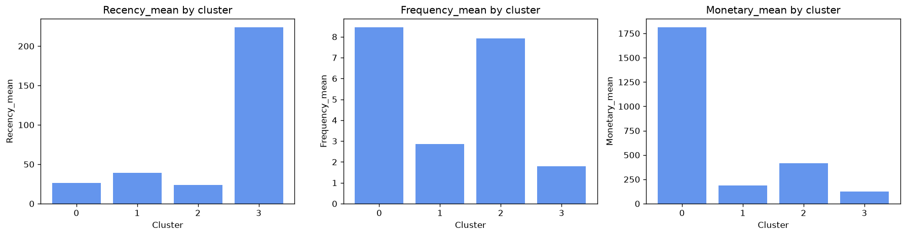

```{=latex}
\thispagestyle{empty}
\begin{center}
\vspace*{2.5cm}
{\LARGE\bfseries Customer Segmentation in E-Commerce Using Purchasing Behaviour and K-Means Clustering\par}
\vspace{2cm}
{\large CMP4294 Introduction to Artificial Intelligence\par}
\vspace{0.6cm}
{\large Assessment 2 --- Data Exploration Report\par}
\vspace{0.6cm}
{\large Student number: 26152255\par}
\vspace{0.6cm}
{\large Repository: \url{https://github.com/angish872-commits/CMP4294-Assessment-2}\par}
\vfill
\end{center}
\newpage
\tableofcontents
\newpage
\listoffigures
\newpage
```

\section*{Abstract}
\addcontentsline{toc}{section}{Abstract}

Raw retail transaction records rarely reveal which customers behave alike. This report examines
whether K-Means clustering can identify meaningful behavioural groups in e-commerce purchasing data.
A reproducible 2,000-row subset of the UCI Online Retail dataset was used to build Recency, Frequency
and Monetary (RFM) features for 141 customers. The features were standardised, and K = 2 to 8 was
tested using inertia and silhouette analysis. K = 4 was selected (silhouette 0.4714) and was stable
across twenty initialisations, producing four segments: high-value loyal, frequent regular, occasional,
and lapsed or low-engagement. A key limitation is that the customer-aware subset compresses the upper
Frequency and Monetary tails.

# Domain Description

E-commerce generates transaction-level data in which each row records a product purchased within an
order. Individually, these rows describe what was sold; across many customers they carry behavioural
information about how often people buy, how recently they bought and how much they spend. These
patterns matter because customers differ widely in value and engagement, and retailers must decide
where to focus limited retention and marketing effort. Customer segmentation groups customers who
behave similarly, so that decisions can be framed around a few interpretable groups rather than
thousands of individual histories. This report tests one data-driven way to form such groups without
assuming that segmentation by itself improves sales.

# Problem Definition

The research question is: can K-Means clustering identify meaningful customer groups from e-commerce
purchasing behaviour so that the retailer can better understand high-value, regular, occasional and
low-engagement customers? Raw transaction records do not directly show which customers behave in
similar ways. The task is descriptive rather than predictive: no outcome is forecast and no label is
known in advance. The aim is to discover similar behavioural groups using one technique, K-Means
clustering. Behaviour is summarised using Recency, Frequency and Monetary value, so each customer is
represented by a small set of interpretable measures. Success is judged by whether the clusters are
distinct, statistically supported and explainable in business terms.

# Brief Literature Review

K-Means is a centroid-based clustering method introduced by MacQueen (1967) and formalised through
least-squares quantisation by Lloyd (1982). It partitions observations into K groups by minimising
within-cluster variance, assigning each point to the nearest centroid under Euclidean distance. Two
properties follow. First, distance is scale-sensitive, so variables measured in different units should
be standardised before clustering (Pedregosa et al., 2011). Second, K must be chosen in advance,
which makes model selection a substantive decision rather than a default. Rousseeuw (1987) proposed
the silhouette coefficient to assess how well a point fits its own cluster relative to the next
closest, providing a separation measure alongside inertia. In customer analysis, RFM is a
long-established representation in which Recency, Frequency and Monetary value summarise purchasing
behaviour (Hughes, 1994; Fader, Hardie and Lee, 2005). Market segmentation theory similarly frames
customers as heterogeneous groups that require different treatment (Wedel and Kamakura, 2000).
Critically, K-Means assumes roughly spherical and comparable clusters and offers no causal explanation;
it describes similarity only. These properties shape both the method used here and the way its output
should be interpreted.

# Dataset Description

The source is the UCI Online Retail dataset (Dua and Graff, 2019), accessed through a Kaggle mirror
(Kaggle, 2021) and licensed under CC BY 4.0. It contains 541,909 transaction rows and eight columns.
Each row records an invoice number (InvoiceNo), product code (StockCode), description (Description),
quantity (Quantity), invoice date (InvoiceDate), unit price (UnitPrice), customer identifier
(CustomerID) and country (Country); Table 1 summarises these attributes. Because customer segmentation
requires a customer key, a reproducible project dataset was built from rows with a valid CustomerID.
The final dataset contains exactly 2,000 rows and eight columns, covering 141 unique customers, 139 of
whom appear in two or more rows. The 2,000-row size is the chosen project scope, not an assessment
maximum. Customers were grouped by order-frequency band and sampled round-robin with a fixed seed,
keeping up to three line items per order and up to ten orders per customer.

**Table 1.** Dataset attributes.

| Column | Meaning |
|--------|---------|
| InvoiceNo | Order identifier; a C prefix marks a cancellation |
| StockCode | Product code |
| Description | Product description |
| Quantity | Units purchased on the line |
| InvoiceDate | Date and time of the order |
| UnitPrice | Price per unit (GBP) |
| CustomerID | Customer identifier |
| Country | Customer country |

# Dataset Pre-processing

Cleaning began from the 2,000-row project dataset. Cancelled invoices, identified by an InvoiceNo
beginning with C, were removed (185 rows), because they represent returns rather than purchases. One
row with a non-positive unit price was removed as invalid, and no duplicate rows were found. The final
cleaned dataset contains 1,814 rows and 141 customers. No missing CustomerID values required removal,
because a customer key was required when the subset was constructed. A transaction value was derived
as TotalPrice = Quantity x UnitPrice.

RFM features were computed per customer against a reference date of 9 December 2011, one day after the
last transaction: Recency is the number of days since the customer last purchased, Frequency is the
number of distinct invoices, and Monetary is the sum of cleaned TotalPrice. The distributions are
right-skewed, with a few high-spend customers, and are shown in Figure 1. No customers were deleted as
outliers, because they represent genuine high-value behaviour; the features were standardised instead.
Three sampling constraints are limitations: at most three line items per order, at most ten orders per
customer, and exclusion of customers with more than thirty source orders. These choices preserve
repeated histories but compress the upper Frequency and Monetary tails.

{width=100%}

# Experiment --- K-Means Clustering

K-Means requires numerical inputs on a comparable scale. Recency is measured in days, Frequency in
orders and Monetary in pounds, so Monetary would otherwise dominate the Euclidean distance and the
segments would mainly reflect spend. All three features were therefore standardised with
StandardScaler to mean zero and standard deviation one (Pedregosa et al., 2011). Clustering used a
fixed random_state of 42 and an explicit n_init of 10. The number of clusters was not assumed.
K = 2 to 8 was evaluated using inertia, which decreases as K rises, and the silhouette coefficient,
which measures cluster separation (Rousseeuw, 1987). Table 2 reports the results, with the elbow
plotted in Figure 2 and the silhouette scores in Figure 3.

**Table 2.** K evaluation results.

| K | Inertia | Silhouette |
|---|---------|------------|
| 2 | 247.11 | 0.4103 |
| 3 | 157.79 | 0.4329 |
| 4 | 91.01 | 0.4714 |
| 5 | 73.21 | 0.4625 |
| 6 | 56.88 | 0.4693 |
| 7 | 43.30 | 0.4270 |
| 8 | 38.53 | 0.3896 |

Inertia falls sharply up to K = 4 and flattens afterwards, and the silhouette score peaks at K = 4
(0.4714). K = 4 was therefore selected: it has the highest separation, the elbow begins to flatten, and
four groups remain interpretable. This is a modelling decision rather than a natural truth, because
K = 4, 5 and 6 produce relatively close silhouette scores. To test dependence on initialisation, K = 4
was re-fitted across random_state values from 0 to 19 with n_init = 10. Silhouette was 0.4714 in every
run, the mean Adjusted Rand Index against the reference solution was 1.0, and the cluster-size
signature was identical in all runs. The solution is stable across the tested initialisations for this
dataset, although this does not establish stability across different samples.

{width=60%}

{width=60%}

```{=latex}
\clearpage
```

# Analysis of Results and Conclusion

The four clusters differ clearly in the measured behaviour, summarised in Table 3 and shown in
Figures 4 and 5. Cluster 0 contains eleven customers who bought very recently (mean Recency 26.55
days), most often (mean Frequency 8.45 orders) and with by far the highest spend (mean Monetary
1,811.52 pounds); this is best described as a high-value loyal group. Cluster 2 (forty customers) is
also recent and frequent (Recency 24.02; Frequency 7.92) but with moderate spend (415.52 pounds),
suggesting a frequent regular group. Cluster 1 is larger (sixty customers) but purchases far less
often (Frequency 2.87) and spends little (187.98 pounds), indicating an occasional group. Cluster 3
(thirty customers) is least recent (Recency 223.73 days), least frequent (1.80 orders) and lowest
spend (126.28 pounds), consistent with a lapsed or low-engagement group. The numeric identifiers are
arbitrary; the labels are analyst interpretations of the computed profiles rather than ground truth.

**Table 3.** Cluster profiles (K = 4).

| Cluster | Customers | Recency mean | Frequency mean | Monetary mean (GBP) | Interpretation |
|---------|-----------|--------------|----------------|---------------------|----------------|
| 0 | 11 | 26.55 | 8.45 | 1,811.52 | High-value loyal |
| 2 | 40 | 24.02 | 7.92 | 415.52 | Frequent regular |
| 1 | 60 | 38.98 | 2.87 | 187.98 | Occasional |
| 3 | 30 | 223.73 | 1.80 | 126.28 | Lapsed or low-engagement |

Business implications follow from these profiles and are stated as possibilities. Retention or loyalty
attention may be appropriate for the high-value loyal group, given its recent and frequent behaviour.
The frequent regular group buys often at lower spend, so there may be potential to increase basket
value. The occasional group is numerous but infrequent, which suggests an opportunity to encourage
repeat purchases. The lapsed group could be a candidate for reactivation campaigns. The data describe
association only and do not test campaign effectiveness.

Several limitations qualify these findings. The customer-aware sampling preserves repeated behaviour
but changes the original distribution, and capping line items and orders compresses the upper tails;
consequently, 141 customers cannot automatically represent the complete retailer population. RFM also
ignores product mix, margin, acquisition source, marketing exposure and website activity. K-Means
assumes roughly spherical clusters, and K selection remains a modelling decision. Most importantly,
clustering identifies similarity, not causation. Within these limits, the research question is
supported: K-Means identified meaningful behavioural groupings in this project sample, but the
segments require cautious interpretation.

{width=62%}

{width=100%}

```{=latex}
\section*{References}
\addcontentsline{toc}{section}{References}
```

Dua, D. and Graff, C. (2019) *UCI Machine Learning Repository*. Irvine, CA: University of California,
School of Information and Computer Science. Online Retail dataset (ID 352). Available at:
https://archive.ics.uci.edu/dataset/352/online+retail (Accessed: 5 October 2026).

Fader, P.S., Hardie, B.G.S. and Lee, K.L. (2005) RFM and CLV: using iso-value curves for customer base
analysis. *Journal of Marketing Research*, 42(4), pp. 415-430.

Hughes, A.M. (1994) *Strategic Database Marketing*. Chicago: Probus Publishing.

Kaggle (2021) *Online Retail Business*. Available at:
https://www.kaggle.com/datasets/umerkk12/online-retail-business (Accessed: 5 October 2026).

Lloyd, S.P. (1982) Least squares quantization in PCM. *IEEE Transactions on Information Theory*,
28(2), pp. 129-137.

MacQueen, J. (1967) Some methods for classification and analysis of multivariate observations. In:
*Proceedings of the Fifth Berkeley Symposium on Mathematical Statistics and Probability, Volume 1*.
Berkeley: University of California Press, pp. 281-297.

Pedregosa, F. et al. (2011) Scikit-learn: machine learning in Python. *Journal of Machine Learning
Research*, 12, pp. 2825-2830.

Rousseeuw, P.J. (1987) Silhouettes: a graphical aid to the interpretation and validation of cluster
analysis. *Journal of Computational and Applied Mathematics*, 20, pp. 53-65.

Wedel, M. and Kamakura, W.A. (2000) *Market Segmentation: Conceptual and Methodological Foundations*.
2nd edn. Boston: Kluwer Academic Publishers.
